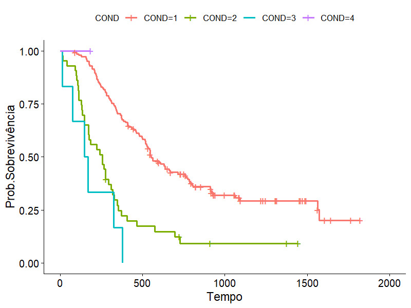
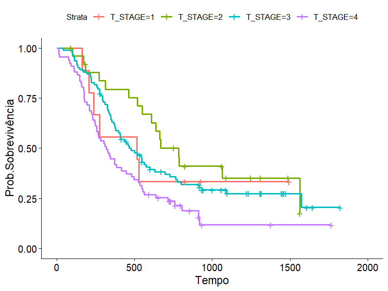
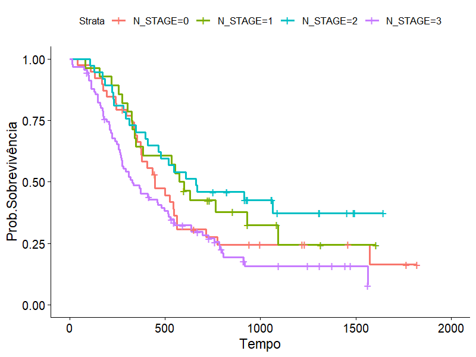
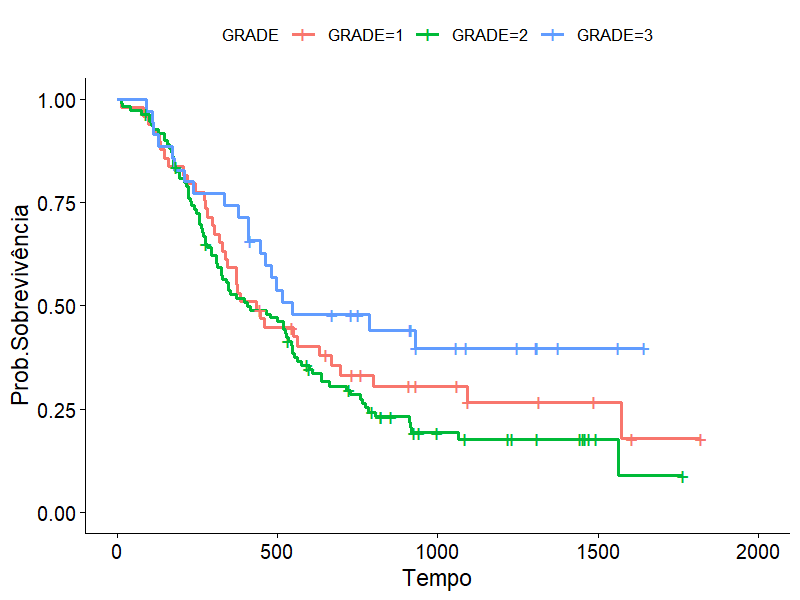
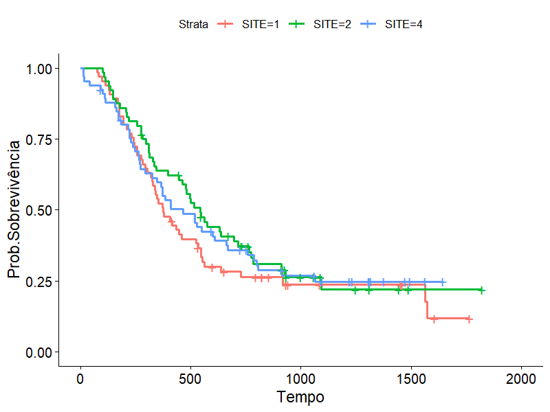
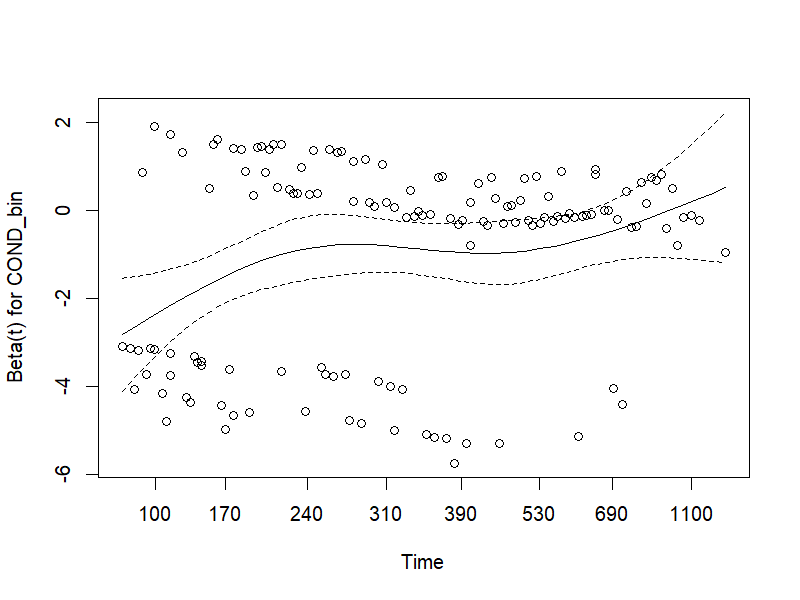
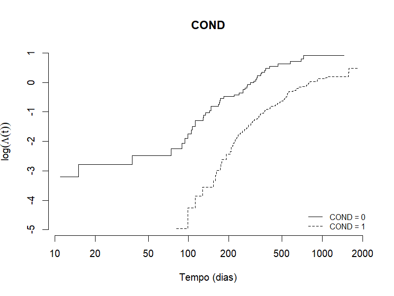

# Utilização do Modelo de Cox em Dados de Pacientes Diagnosticados com Carcinoma Espinocelular da Orofaringe

> Trabalho de Conclusão de Curso — Bacharelado em Estatística  
> Universidade Federal de Ouro Preto (UFOP), 2026  

---

##  Sobre o Projeto

Este estudo aplica técnicas de **análise de sobrevivência** para investigar os fatores prognósticos associados ao tempo de sobrevida de pacientes diagnosticados com **carcinoma espinocelular da orofaringe** — um tipo de câncer de pele.

A motivação central é que dados clínicos de tempo-até-evento frequentemente apresentam **censura** (pacientes que não chegaram ao desfecho durante o estudo), o que inviabiliza métodos estatísticos tradicionais e exige técnicas específicas de sobrevivência.

---

##  Dados

- **Fonte:** Radiation Therapy Oncology Group (RTOG) — estudo clínico multicêntrico com 16 instituições
- **Amostra:** 195 pacientes diagnosticados com carcinoma espinocelular da orofaringe
- **Desfecho:** Tempo em dias do diagnóstico até o óbito (`Sobrevivência`)
- **Censura:** Tipo à direita — pacientes que não apresentaram óbito durante o período de estudo (`Status = 0`)

### Variáveis analisadas

| Variável | Descrição |
|---|---|
| `GRADE` | Grau histológico do tumor (bem / moderadamente / pouco diferenciado) |
| `SITE` | Local da doença na orofaringe |
| `T_STAGE` | Estadiamento do tumor primário (T1 a T4) |
| `N_STAGE` | Comprometimento linfonodal (N0 a N3) |
| `COND` | Condição funcional do paciente (sem incapacidade até acamado) |
| `SEX` | Sexo do paciente |
| `TRT` | Tipo de tratamento (radioterapia padrão ou combinada com quimioterapia) |

---

##  Metodologia

### 1. Análise Descritiva
Caracterização do perfil clínico dos pacientes e quantificação da proporção de censuras na amostra.

### 2. Dicotomização das Covariáveis
Covariáveis com mais de duas categorias foram dicotomizadas com base na comparação das curvas de sobrevivência — agrupando categorias com comportamento similar identificado pelo **teste de log-rank**.

### 3. Estimador de Kaplan-Meier
Estimação não paramétrica das curvas de sobrevivência para cada covariável, com comparação visual entre grupos.

### 4. Teste de Log-Rank
Teste de hipótese para verificar se existem diferenças estatisticamente significativas entre as curvas de sobrevivência dos grupos (nível de significância: α = 0,05).

### 5. Modelo de Regressão de Cox
Ajuste do **modelo de riscos proporcionais de Cox** para identificação dos fatores prognósticos independentes associados ao risco de óbito, com seleção de variáveis baseada em significância estatística (p < 0,05).

### 6. Avaliação da Adequação do Modelo
- **Resíduos de Schoenfeld:** verificação da suposição de proporcionalidade dos riscos
- **Gráfico log(Λ(t)) vs t:** inspeção visual do cruzamento de curvas para covariáveis com sinal de violação

---

##  Principais Resultados

O modelo final de Cox reteve as covariáveis **GRADE**, **T_STAGE**, **N_STAGE** e **COND**:

| Covariável | Razão de Risco (HR) | p-valor | Interpretação |
|---|---|---|---|
| GRADE | 0,63 | 0,06 | Grau pouco diferenciado associado a menor risco |
| T_STAGE | 1,51 | 0,02 | Tumor maciço invasivo aumenta risco em 51% |
| N_STAGE | 1,40 | 0,06 | Múltiplos linfonodos aumentam risco em 40% |
| COND | 0,36 | <0,001 | Pacientes sem incapacidade têm risco 2,8x menor |

**Principais achados:**
- A **condição funcional** foi o fator mais fortemente associado ao risco de óbito
- Pacientes com **tumor invasivo maciço (T4)** tiveram risco 51% maior que estágios iniciais
- O **comprometimento linfonodal múltiplo** aumentou o risco em 40%
- A avaliação dos resíduos de Schoenfeld confirmou adequação global do modelo

---

##  Ferramentas e Pacotes

- **Linguagem:** R
- **Pacotes principais:**
  - `survival` — estimador de Kaplan-Meier, teste de log-rank, modelo de Cox
  - `survminer` — visualização das curvas de sobrevivência (ggplot2-based)
  - `ggplot2` — gráficos dos resíduos e diagnósticos

---

##  Visualizações
 
### Curvas de Kaplan-Meier
 
#### Condição Funcional do Paciente (COND)
> Covariável com maior impacto na sobrevida — pacientes sem incapacidade apresentam probabilidade de sobrevivência significativamente maior (p < 0,001)
 

 
#### Estadiamento do Tumor (T_STAGE)
> Tumores invasivos maciços (T4) apresentam queda acentuada na curva de sobrevivência em relação aos estágios iniciais (p = 0,004)
 

 
#### Comprometimento Linfonodal (N_STAGE)
> Separação progressiva das curvas ao longo do tempo — pacientes com múltiplos linfonodos comprometidos têm pior prognóstico (p = 0,004)
 

 
#### Grau Histológico (GRADE)
> Diferença significativa entre grau moderadamente diferenciado e pouco diferenciado (p = 0,03)
 

 
#### Local da Doença (SITE)
> Curvas sem diferença estatisticamente significativa entre os grupos (p > 0,05)
 

 
---
 
### Diagnóstico do Modelo de Cox
 
#### Resíduos de Schoenfeld
> Ausência de inclinação relevante confirma a suposição de proporcionalidade dos riscos para GRADE, T_STAGE e N_STAGE
 

 
#### log(Λ(t)) vs tempo — COND
> Curvas sem cruzamento indicam que, apesar do sinal no teste formal, a violação da proporcionalidade para COND não é severa
 

---

##  Referências

- COX, D. R. Regression models and life-tables. *Journal of the Royal Statistical Society*, v. 34, n. 2, p. 187–220, 1972.
- KAPLAN, E. L.; MEIER, P. Nonparametric estimation from incomplete observations. *JASA*, v. 53, n. 282, p. 457–481, 1958.
- COLOSIMO, E. A. *Análise de sobrevivência aplicada*. 2. ed. São Paulo: Blucher, 2024.

---

